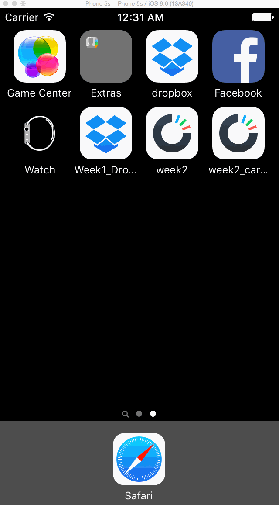

# week2_carousel
Hours: 15+
Got almost everything working aside from the unauth homescreen animation and some last minute bug on Sign In that I can't figure out. Tried googling but wasn't able to locate the error mentioned in the code. 

Also just noticed that the milestones don't exactly match the requirements but was working from the milestones, so there may be some discrepancies. 

Optionals:
-Signup: keyboard animation, checkbox
-Sign in: keyboard animation (minus scaling, didn't notice)

